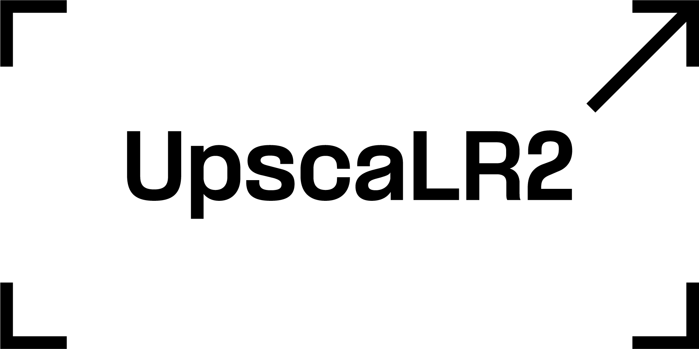

UpscaLR2 is an injected .dll for Lunatic Rave 2,
which fixes fullscreen mode crashes and introduces
multiple upscaling methods to choose from.

## How To

1. Download `fmodex.dll` and `UpscaLR2.dll` from one of [releases](https://github.com/MatVeiQaaa/UpscaLR2/releases). If you don't which one you want, grab [latest](https://github.com/MatVeiQaaa/UpscaLR2/releases/latest).
2. Rename `fmodex.dll` in the root of your Lunatic Rave 2 folder into `fmodex_real.dll`. 
3. If you previously used a chainloader to load your mods, remove `d3d9.dll` from the game folder.
4. Put downloaded files in the root of Lunatic Rave 2 folder.
5. Modify/Create `chainload.txt` file, adding `UpscaLR2.dll` to it's first line. It must be first in the load order.
6. See `UpscaLR2.ini` configuration file, which is generated upon first game launch with the mod, to adjust the settings. Settings apply at game launch.

> [!NOTE]
> If you are using graphical mods like [Lr2ArenaEx](https://github.com/SayakaIsBaka/LR2ArenaEx) or [LR2OOL](https://github.com/tenaibms/LR2OOL), make sure they are at least dated `12 May 2026`.
> Any future graphical mods will have to implement appropriate DirectX pipeline if they are to work correctly with this project.

## Special Thanks

[nyannurs](https://www.twitch.tv/beachsidebunny), for being the reason this project exists.

**Anonymous LR2 reverser**, for being the reason this project is possible.
